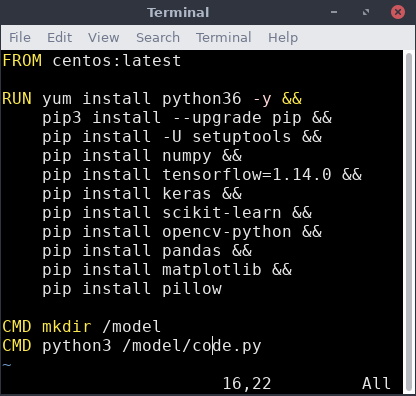
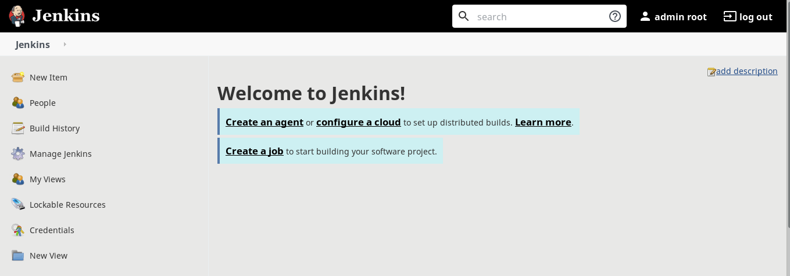
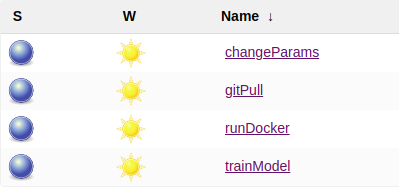

# MLwithJenks
> Integrating Machine Learning with DevOps

In this project, I aim to achieve the end-to-end integration and functioning of a ML model deployed in a container tightly maintained with Jenkins.

## ML Model : 
The ML model 

## DevOps : 
With this, I've tried to automate the training process of ML model with docker containers to involve least human interaction and labour.

## Overall Functioning : 

## Steps : 

### 1. Dockerfile

You can download the image from [docker hub](https://hub.docker.com/).

### 2. Configuring Jenkins

### 3. Setting up jenkins jobs

1. GitPull : This pulls the latest chnages from the github repo pushed by the developer

2. RunDocker : This provisions the docker container with the code.py within the container

3. TrainModel : This job trains the ML model within the container

4. ChangeParams : This chnages the code params to get better test results

---

> ### The project is under development

